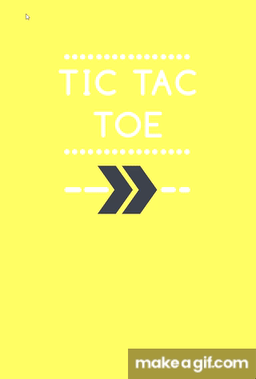

# Tic Tac Toe Game

This is a simple Tic Tac Toe game created using SFML (Simple and Fast Multimedia Library) for the user interface. The game provides a visually appealing interface for players to enjoy the classic Tic Tac Toe experience.

## Features

- **Visual Appeal:** The game utilizes SFML to create an attractive and intuitive user interface.
- **Two Player:** Play against a friend on the same device.
- **Responsive Design:** The game adapts to various screen sizes, making it playable on both desktop and mobile devices.

## Installation

### Prerequisites

- C++ Compiler
- SFML Library

### Steps

1. Clone the repository:

    ```
    https://github.com/MgMap/TicTacToe_sfml.git
    ```

2. Compile the source code using your preferred C++ compiler. Make sure to link SFML properly.

3. Run the compiled executable to start the game.

## Usage

- Upon launching the game, choose the game mode (Single Player or Two Player).
- Follow the on-screen instructions to make your moves.
- Enjoy playing Tic Tac Toe with a visually appealing interface!

## GIF



## Acknowledgements

- [SFML](https://www.sfml-dev.org/) - Simple and Fast Multimedia Library
- [TheCherno](https://www.youtube.com/user/TheChernoProject) - For SFML tutorials and inspiration.